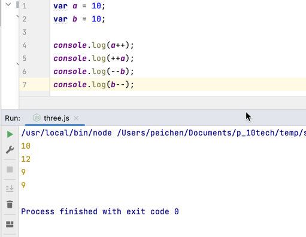

一、判断题

1.Java 是编译型语言。  ——❌
2.Javascript 中，不区分大小写字母，也就是说 A 和 a 是同一个变量。  ——❌  
3.Javascript 中的常量包括 String、Number、Boolean、Null、Undefined。  ——❌  
4.String 字符串的语法中既可以使用单引号，也可以使用双引号。  ——✅  
5.typeof 是用来判断变量类型，不可以当作运算符使用。  ——❌  
6.任何值和 undefined 运算，undefined 可看做 0 运算。  ——❌  

二、请分别描述下列代码中“+”的作用。  
console.log(“年龄:” + 20);  ——**年龄:20（字符串拼接）**  
console.log(11+22+33);  ——**66（计算）**  
console.log(“网络 + 安全”);  ——**网络安全（字符串拼接）**  
var a = 1;  
var b = 2;  
console.log(“a” + b);  ——**a2**  
var a = 1;  
var b = 2;  
console.log(“a + b”);  ——**a+b**  

三、计算下述代码的打印值
var a = 10;
var b = 10;
console.log(a++);  ——**10**  
console.log(++a);  ——**12**  
console.log(--b);  ——**9**  
console.log(b--);  ——**9**

四、分别使用行内式、内嵌式、引入外部文件的方法造成网页弹窗，要求触发弹窗的 JavaScript 命令不止一种（alert、print、prompt）。

五、安装 Docker 并练习以下基础命令、帮助命令、镜像命令和容器命令:

帮助命令
docker 命令 --help
镜像命令
docker images 列出所有镜像
docker search 搜索镜像
docker pull 下载镜像
docker rmi 删除镜像
作业提交方式请参考：

作业提交方式： https://u.geekbang.org/lesson/521?article=659624
使用 Gitee 上传作业的方法：  https://u.geekbang.org/lesson/521?article=686924
请各位同学课后及时练习回顾上述 Docker 命令，下次课程将在此基础之上讲解靶场的搭建。